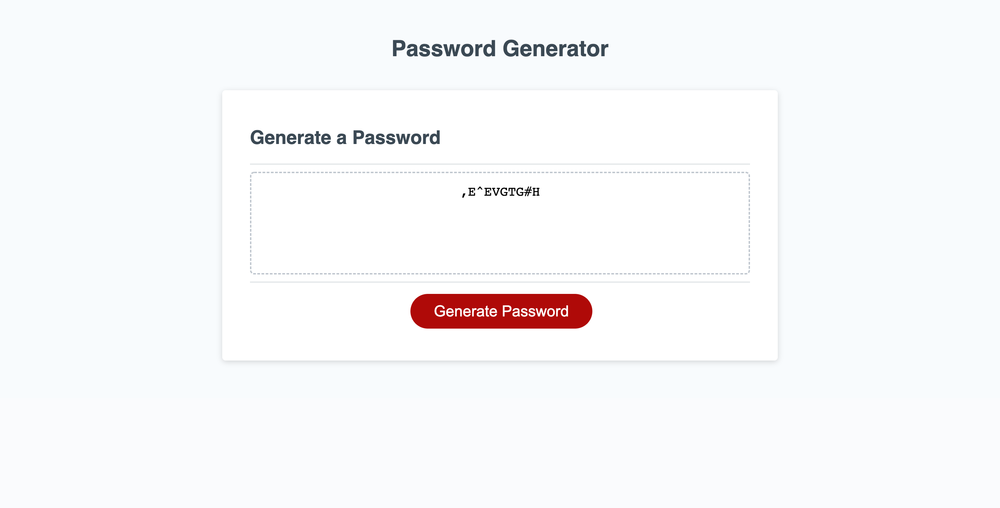
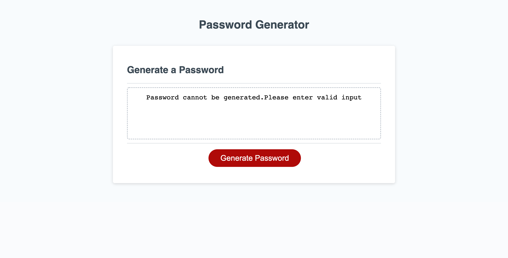

# Random Password Generator 

## Desscription

 Random Password Generator  is an Application to generate a random Password following the criteria provided by the user.

  
 By clicking the Generate Password button,user is asked to enter a password length which is validated as a numerical value between 8 and 128 characters.
 If not Application will display an error message.

  
 If its a valid length user is prompted to confirm 
 if password needs lowercase,uppercase,numerical and/or
 special characters.Input is validated for  one of the character type to be selected.If not an error message is thrown,else a random password is generated 

 

### User Story
 

AS AN employee with access to sensitive data
I WANT to randomly generate a password that meets certain criteria
SO THAT I can create a strong password that provides greater security.

### Acceptance Criteria

 

GIVEN I need a new, secure password
*  WHEN I click the button to generate a password THEN I am presented with a series of prompts for password criteria
* WHEN prompted for password criteria THEN I select which criteria to include in the password.
*  WHEN prompted for the length of the password THEN I choose a length of at least 8 characters and no more than 128 characters
* WHEN asked for character types to include in the password THEN I confirm whether or not to include lowercase, uppercase, numeric, and/or special characters
* WHEN I answer each prompt THEN my input should be validated and at least one character type should be selected
* WHEN all prompts are answered THEN a password is generated that matches the selected criteria
* WHEN the password is generated THEN the password is either displayed in an alert or written to the page

## Links

## Technologies Used

* [x] HTML
* [x] CSS
* [x] Javascript

## Screenshot

Below is the screenshot of tha Application with Password generated

 

Below is the screenshot of Application with error message if any criteria is not satisfied

